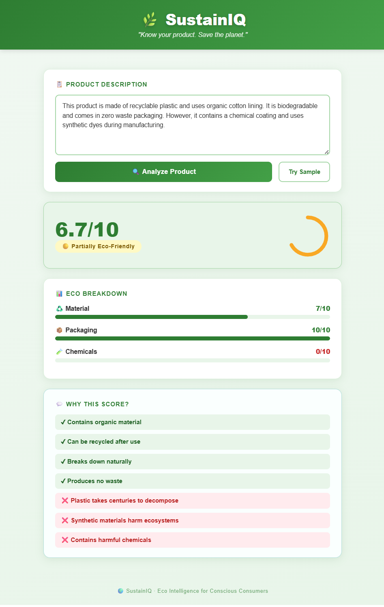

# 🌿 SustainIQ – Eco Product Analyzer

> "Know your product. Save the planet."

SustainIQ is a beginner-friendly Flask web app that analyzes product descriptions
and tells you how eco-friendly they are — giving a score, a breakdown by category,
and clear reasons why.

---

## 📁 Project Structure

```
SustainIQ/
│
├── Ecoapp.py              ← Flask backend + analysis logic
├── templates/
│   └── index.html         ← HTML page (Bootstrap 5)
├── static/
│   └── style.css          ← Custom eco green CSS
├── requirements.txt       ← Python dependencies
└── README.md              ← This file
```

---

## ⚙️ How to Run

### 1. Install dependencies
```bash
pip install -r requirements.txt
```

### 2. Start the app
```bash
python Ecoapp.py
```

### 3. Open in browser
```
http://127.0.0.1:5000
```

---

## 🧠 How It Works

1. **User** pastes a product description into the text box.
2. **Backend** scans for eco-related keywords (organic, recyclable, toxic, plastic…).
3. **Score** is calculated: positive keywords raise it, negative ones lower it.
4. **Results** show:
   - Overall score (1–10) with a circular gauge
   - Verdict: 🟢 Eco-Friendly / 🟡 Partial / 🔴 Harmful
   - Per-category progress bars (Material, Packaging, Chemicals, Energy, Sustainability)
   - Explanation box with ✔ / ❌ reasons
   - ⚠️ Low-data warning if very few keywords were found

---

## 🎨 UI Highlights

- Bootstrap 5 for layout & components
- Custom green theme (`#2E7D32`, `#A5D6A7`)
- Animated progress bars and SVG score ring
- Clean card design with shadows and rounded corners
- Fully responsive (works on mobile)

---
## 📸 Screenshot



---

## 💡 Example Input

```
This bottle is made of recyclable plastic with an organic cotton sleeve.
It is biodegradable and uses zero waste packaging. However, it contains
a chemical coating and synthetic dyes.
```

**Expected output:** ~6.5/10 · Partially Eco-Friendly

---

## 🔧 Adding More Keywords

Open `Ecoapp.py` and add entries to `POSITIVE_KEYWORDS` or `NEGATIVE_KEYWORDS`:

```python
"hemp": {"category": "Material", "emoji": "♻️", "weight": 2, "reason": "Hemp grows without pesticides"},
```

---

Made with 🌱 for conscious consumers.
